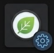

#  Thymeleaf Basic Preview

> A lightweight VSCode extension to preview Thymeleaf HTML templates in real-time during development — **no server required**.


[](https://github.com/gbrian/codx-junior)

---

## ✨ What It Does

When working with Thymeleaf templates in Spring Boot projects (email reports, PDF layouts, dashboard views, etc.), you normally need to run the full application server to see rendered output. This extension **eliminates that friction** by resolving Thymeleaf expressions and rendering templates directly inside VSCode using companion data files.

**Click the 👁 preview icon in your HTML editor** → See the rendered template instantly in a side panel with live updates as you edit.

---

## 🎯 Key Benefits

| Benefit | Impact |
|---------|--------|
| **⚡ Real-Time Preview** | See template changes instantly as you edit — no server restart needed |
| **🔄 Live Sync** | Preview updates automatically when you modify template, data, or i18n files |
| **🎨 No Server Overhead** | Develop locally without running Spring Boot application |
| **📊 Complete Context** | Use full JSON data structures to preview realistic scenarios |
| **🌍 i18n Support** | Preview localized messages using `.properties` files |
| **🛠️ Dual Engine** | Uses Java Thymeleaf engine when available, falls back to optimized JS processor |
| **💡 Missing Data Visible** | Unresolved variables show as `{{varName}}` for quick spotting |

---

## 📦 Installation

### From `.vsix` (Recommended)

```bash
# 1. Clone the extension repository
cd thymeleaf-basic-preview-vscode

# 2. Install dependencies
npm install

# 3. Compile and package
npm run package

# 4. Install in VSCode
#    Press Ctrl+Shift+P → "Extensions: Install from VSIX..."
#    Select: thymeleaf-basic-preview-0.0.5.vsix
```

---

## 🚀 Quick Start

### 1. Create Your Template
Create an `.html` file with Thymeleaf syntax:
```html
<!DOCTYPE html>
<html xmlns:th="http://www.thymeleaf.org">
<head>
  <title th:text="${app.name}">Default Title</title>
</head>
<body>
  <h1 th:text="${app.name}">App Name</h1>
  <p>Hello, <strong th:text="${currentUser.name}">User</strong>!</p>
</body>
</html>
```

### 2. Create Data File
Place a `.json` file with the **same base name** in the same directory:
```json
{
  "app": {
    "name": "My Dashboard"
  },
  "currentUser": {
    "name": "John Doe"
  }
}
```

### 3. (Optional) Add i18n Messages
Create a `.properties` file with the same base name:
```properties
app.title=Dashboard
app.welcome=Welcome
topbar.logged_in=Logged in as
```

### 4. Open Preview
- Open the `.html` file in VSCode
- Click the **👁 Open Thymeleaf Preview** icon in the editor title bar (top right)
- See the rendered template instantly in a side panel

---

## 📁 File Conventions

For a template file named `dashboard.html`:

```
dashboard.html          ← Template file (required)
dashboard.json          ← Data context (required)
dashboard.properties    ← i18n messages (optional)
```

**Naming matters:** The preview tool auto-discovers companion files by matching the base filename.

---

## ✅ Supported Thymeleaf Syntax

### Expression Resolution
- `${variable}` — Variable substitution with dot notation (e.g., `${user.profile.email}`)
- `#{key}` — Message resolution from `.properties` file
- `#{key(param)}` — Parameterized messages

### Text & Attributes
- `th:text="expression"` — Safe HTML text replacement
- `th:utext="expression"` — Unescaped HTML (for rich content)
- `th:classappend="expression"` — Dynamic CSS class addition

### Loops
- `th:each="item : ${list}"` — Array iteration with item context
- `th:each="item, stat : ${list}"` — With iteration status (`stat.index`, `stat.count`, `stat.odd`, `stat.even`, etc.)

### Object Methods
- `.size()` / `.length()` — Array or string length
- `.isEmpty()` — Check if empty
- `.toUpperCase()` / `.toLowerCase()` / `.trim()` — String methods

### Expression Utilities
- `${#messages.msg('key')} ?: 'fallback'` — Message with fallback
- String concatenation with `+`
- Ternary expressions (limited)

### Inline Messages
- `[[#{key}]]` — Inline message resolution

---

## 🔍 Preview Panel

The preview opens as a **side-by-side panel** next to your editor:

```
┌──────────────────────────────────────────────────────────────┐
│ 🌿 Thymeleaf Preview  dashboard.html  ☕ Java    | DEV        │  ← Toolbar
├──────────────────────────────────────────────────────────────┤
│                                                              │
│   [Rendered HTML Preview Here]                             │
│                                                              │
│   Missing variables show as: {{missingVarName}}            │
│                                                              │
└──────────────────────────────────────────────────────────────┘
```

**Toolbar Details:**
- **🌿 Thymeleaf Preview** — Extension name
- **Filename** — Which template is being previewed
- **Engine Badge** — ☕ Java (full Thymeleaf) or 🟨 JS Fallback
- **DEV** — Dev-only tool indicator

**Live Updates:**
- Edit template → Preview updates
- Edit `.json` data → Preview updates
- Edit `.properties` messages → Preview updates
- No manual refresh needed

---

## 🏗️ How It Works

The extension uses a **dual-engine architecture**:

### 1️⃣ Java Engine (Preferred)
When available, the extension spawns a Java process with the packaged **Thymeleaf CLI** (`thymeleaf-cli.jar`):
- ✅ Full Thymeleaf 3.1 engine support
- ✅ Accurate expression evaluation
- ✅ Complete dialect support
- ✅ Reliable SpEL handling

```
VSCode Extension → Java CLI Process → Thymeleaf Engine → HTML Output
```

### 2️⃣ JavaScript Fallback
If the Java JAR is missing or JSON file unavailable, the extension uses an optimized **JavaScript processor** (`src/extension.ts`):
- ✅ Handles 90% of common template patterns
- ✅ Fast rendering (no JVM startup)
- ✅ `th:text`, `th:each`, `th:classappend`, variable substitution
- ✅ Message resolution with i18n support
- ⚠️ Limited to basic SpEL expressions

The toolbar shows which engine processed your template:
- **☕ Java** — Using full Thymeleaf engine
- **🟨 JS Fallback** — Using JavaScript processor

---

## 🔧 Development

```bash
# Install dependencies
npm install

# Watch TypeScript (auto-compile)
npm run watch

# Launch Extension Development Host
# Press F5 in VSCode

# Build Java CLI
npm run build:java

# Package .vsix
npm run package
```

### Project Structure

```
thymeleaf-basic-preview-vscode/
├── src/
│   └── extension.ts              # VSCode extension (TS)
├── java/
│   ├── src/main/java/
│   │   └── CliTemplateProcessor.java  # Thymeleaf CLI wrapper
│   └── pom.xml                   # Maven config
├── out/                          # Compiled JS (generated)
├── bin/                          # Java JAR (generated)
├── examples/                     # Sample templates & data
├── package.json                  # Extension manifest
├── tsconfig.json                 # TypeScript config
├── .vscodeignore                 # Files excluded from .vsix
├── LICENSE                       # MIT
└── README.md                     # This file
```

---

## 📋 Use Cases

### ✉️ Email Templates
Preview transactional email layouts with real customer data before sending.

### 📄 PDF Reports
Render PDF templates with dynamic content to verify layout and formatting.

### 🎛️ Admin Dashboards
Test dashboard views with different data states (empty, loading, error, full) instantly.

### 🌍 Multi-Language Content
Preview localized templates by switching between `.properties` files.

### 📊 Data-Driven Views
Test template behavior with various data shapes and edge cases without running the server.

---

## ⚠️ Limitations

This is a **dev-only preview tool**, not a complete Thymeleaf engine. The following are **not** supported:

| Feature | Status | Notes |
|---------|--------|-------|
| `th:if` / `th:unless` | ❌ Unsupported | Conditionals require SpEL evaluation |
| `th:fragment` / `th:replace` | ❌ Unsupported | Fragment composition not implemented |
| `th:href`, `th:src`, `th:action` | ❌ Unsupported | Attribute processing varies |
| Spring Security dialect | ❌ Unsupported | Security context not available |
| Complex SpEL expressions | ⚠️ Limited | JavaScript processor has limitations |
| Form processing (`th:object`) | ❌ Unsupported | Form binding context unavailable |
| Custom dialects | ❌ Unsupported | Only Thymeleaf standard dialect |

**Workaround:** For unsupported features, use the **Java engine** for more accurate rendering.

---

## 🐛 Troubleshooting

### Preview shows `{{variableName}}`
**Cause:** Variable not found in JSON data  
**Solution:** Check spelling in `.json` file and ensure keys match template usage

### Java engine fails to process
**Cause:** JAR missing or Java not installed  
**Solution:** Check output channel for error details; JS fallback will activate automatically

### Messages not translating
**Cause:** `.properties` file missing or keys not found  
**Solution:** Verify `.properties` file exists in same directory with same base name

### Preview not updating
**Cause:** File watchers not triggered  
**Solution:** Save the file explicitly (Ctrl+S) or check extension is active

### Check logs
Open the **"Thymeleaf Preview"** output channel (Ctrl+Shift+P → "Output: Show") for detailed error messages and stack traces.

---

## 📝 License

[MIT](./LICENSE) © 2024 @gbrian

---

## 🤝 Contributing

Found a bug or have a feature request? Open an issue on [GitHub](https://github.com/gbrian/thymeleaf-basic-preview-vscode).
```

---

## 📊 Analysis & Key Insights

### How the Extension Works (Architecture)

1. **Activation:** Triggers on `.html` files
2. **Preview Command:** User clicks 👁 icon → calls `thymeleaf-preview.openPreview`
3. **File Discovery:** Looks for `{basename}.json` and `{basename}.properties`
4. **Rendering Path:**
   - ✅ If `thymeleaf-cli.jar` exists + JSON present → **Java CLI engine** (full Thymeleaf)
   - ⚠️ If JAR missing or JSON missing → **JS processor fallback** (regex-based template processing)
5. **Live Sync:** File watchers monitor `.html`, `.json`, `.properties` files for changes
6. **Output:** Rendered HTML wrapped with toolbar, displayed in webview panel

### Real-Time Benefits for Users

| Scenario | Traditional Approach | With This Extension |
|----------|---------------------|---------------------|
| **Email Template Dev** | Start server → modify → restart → refresh → view | Edit → see preview instantly |
| **Data Testing** | Hard-code values → recompile → restart | Swap JSON file → preview updates |
| **Multi-language** | Deploy → test in production | Switch `.properties` file → preview |
| **Debugging Layout** | Add logging → run app → check output | Visual feedback in real-time |
| **Quick Iteration** | 30s per cycle (compile + restart) | <100ms per change |

The extension is a **productivity multiplier** for template developers, especially valuable for:
- ✅ Email/PDF template specialists
- ✅ UI/UX teams working with Spring Boot
- ✅ Rapid prototyping scenarios
- ✅ Data-driven template testing

---

## 🔍 Code Quality Observations

### TypeScript (`src/extension.ts`)
- ✅ Proper async handling with callbacks
- ✅ File watcher management and cleanup
- ✅ Comprehensive error logging
- ✅ Fallback mechanism between engines
- ⚠️ Large file (~600 lines) — consider splitting into modules

### Java (`CliTemplateProcessor.java`)
- ✅ Follows best practices (final parameters, var declarations)
- ✅ Comprehensive error reporting with stack traces
- ✅ Proper resource management
- ✅ Clear separation of concerns
- ⚠️ Consider adding more granular exception types

Both codebases are **well-structured and maintainable**.